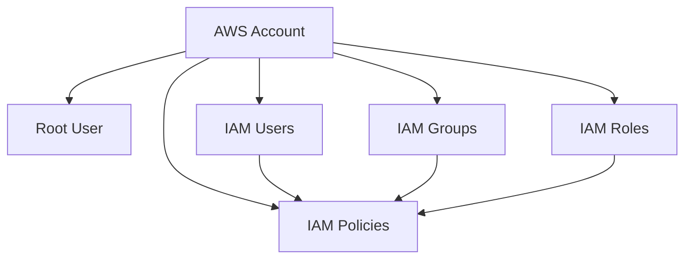
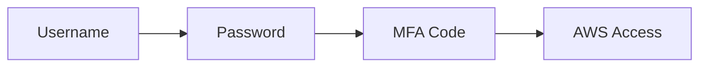
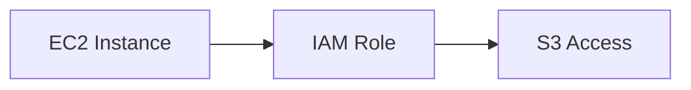

# AWS IAM (Identity and Access Management) - Complete Guide

## What is IAM?

IAM (Identity and Access Management) is a **global AWS service** that helps you securely control who can access AWS resources and what actions they can perform.

Think of IAM as the **security guard of your AWS account**.

It answers two important questions:

1. **Who are you?** (Authentication)
2. **What are you allowed to do?** (Authorization)

---

## Why Do We Need IAM?

Imagine a company with:

- Developers
- DevOps Engineers
- Security Team
- Database Administrators

Without IAM:

- Everyone would use the Root Account
- No access control
- High security risk
- Difficult auditing

With IAM:

- Each user gets individual credentials
- Permissions are controlled
- Activities are traceable
- Better security

---

# IAM Architecture



---

# Root Account

## What is Root User?

When an AWS account is created, AWS automatically creates a **Root User**.

The Root User has:

- Full access to everything
- Cannot be restricted
- Can delete the AWS account

---

## Why Should You Avoid Using Root User?

Because if Root credentials are compromised:

- Entire AWS account is compromised
- All services can be deleted
- Billing information can be modified

---

## Best Practice

```text
Create AWS Account
        ↓
Enable MFA
        ↓
Create IAM Admin User
        ↓
Stop using Root User
```

---

# IAM Users

## What is an IAM User?

An IAM User represents a person or application that needs access to AWS.

Examples:

| User | Department |
|--------|------------|
| Alice | Developer |
| Bob | Developer |
| David | Operations |
| Edward | Security |

---

## IAM User Components

Every IAM User can have:

### 1. Password

Used for AWS Console Login.

```text
https://console.aws.amazon.com
```

---

### 2. Access Keys

Used for:

- AWS CLI
- SDK
- APIs

Example:

```text
Access Key ID:
AKIAxxxxxxxxxxxx

Secret Access Key:
abcdxxxxxxxxxxxx
```

---

# IAM Groups

## What is an IAM Group?

A Group is a collection of IAM Users.

Instead of assigning permissions to every user individually, assign permissions to the group.

---

## Example

### Developers Group

```text
Alice
Bob
Charles
```

Permission:

```text
EC2 Access
S3 Read Access
```

All users automatically receive these permissions.

---

## Important Rules

### Group can contain only users

✅ Allowed

```text
Developers Group
 ├── Alice
 ├── Bob
```

❌ Not Allowed

```text
Group A
 └── Group B
```

AWS does not support nested groups.

---

## User Can Belong to Multiple Groups

Example:

```text
Charles
   ├── Developers
   └── Audit Team
```

This means Charles inherits permissions from both groups.

---

# IAM Policies

## What is a Policy?

Policies are JSON documents that define permissions.

Policies determine:

- What actions are allowed
- What actions are denied
- Which resources can be accessed

---

## Real World Analogy

Imagine a company ID card.

The ID card may allow:

```text
Enter Building
Access Cafeteria
Access Office Floor
```

Similarly IAM Policy grants permissions.

---

# IAM Policy Structure

```json
{
  "Version": "2012-10-17",
  "Statement": [
    {
      "Effect": "Allow",
      "Action": "s3:GetObject",
      "Resource": "*"
    }
  ]
}
```

---

# Policy Components

## Version

Policy language version.

Always use:

```json
"Version": "2012-10-17"
```

---

## Statement

Contains permission rules.

```json
"Statement": []
```

---

## Effect

Defines whether access is allowed or denied.

```json
"Effect": "Allow"
```

or

```json
"Effect": "Deny"
```

---

## Action

AWS API actions allowed.

Examples:

```json
"s3:GetObject"
```

```json
"ec2:StartInstances"
```

```json
"ec2:DescribeInstances"
```

---

## Resource

Resource affected.

Example:

```json
"Resource":"arn:aws:s3:::mybucket/*"
```

---

## Condition (Optional)

Adds restrictions.

Example:

```json
"Condition":{
    "IpAddress":{
        "aws:SourceIp":"192.168.1.1"
    }
}
```

---

# Example IAM Policy

Allow reading files from S3.

```json
{
  "Version": "2012-10-17",
  "Statement": [
    {
      "Effect":"Allow",
      "Action":"s3:GetObject",
      "Resource":"arn:aws:s3:::company-bucket/*"
    }
  ]
}
```

---

# IAM Policy Inheritance

Permissions can come from:

```text
User
Group
Role
```

---

Example:

```text
Developers Group
    ↓
EC2 Read Access

Alice
Bob
Charles
```

All users inherit permissions.

---

# Principle of Least Privilege

## Definition

Give users only the permissions they need.

### Bad Example

```text
Developer
    ↓
AdministratorAccess
```

Too many permissions.

---

### Good Example

```text
Developer
    ↓
EC2 Read Only
S3 Read Only
```

Only required permissions.

---


## Prevent Password Reuse

Example:

```text
Cannot reuse last 24 passwords
```

---

# Multi-Factor Authentication (MFA)

## What is MFA?

MFA = Password + Security Device

Authentication requires:

```text
Something You Know
+
Something You Have
```

---

## Login Flow



---

## Example

User enters:

```text
Username
Password
```

Then:

```text
6 Digit OTP
```

Generated by:

- Google Authenticator
- Microsoft Authenticator
- Hardware Token

---

## Benefits of MFA

Even if password is stolen:

```text
Attacker Still Needs MFA Device
```

Thus account remains protected.

---

# AWS CLI

## What is AWS CLI?

CLI = Command Line Interface

Allows interacting with AWS using terminal commands.

---

## Why Use CLI?

- Automation
- Scripting
- Faster than Console
- DevOps workflows

---

## Example

List S3 Buckets

```bash
aws s3 ls
```

---

Upload File

```bash
aws s3 cp app.zip s3://mybucket/
```

---

Create EC2 Instance

```bash
aws ec2 run-instances
```

---

# AWS SDK

## What is SDK?

SDK = Software Development Kit

Allows applications to communicate with AWS services programmatically.

---

## Difference Between CLI and SDK

| AWS CLI | AWS SDK |
|----------|---------|
| Used in Terminal | Used in Code |
| Manual Execution | Programmatic |
| Scripting | Application Development |

---

## Python SDK Example (Boto3)

```python
import boto3

s3 = boto3.client('s3')

response = s3.list_buckets()

for bucket in response['Buckets']:
    print(bucket['Name'])
```

---

# IAM Roles

## What is a Role?

A Role is a set of permissions that can be temporarily assumed.

Unlike users:

```text
User = Permanent Identity

Role = Temporary Identity
```

---

# Why Roles Exist?

AWS Services need permissions too.

Example:

```text
EC2 Instance
      ↓
Read files from S3
```

Instead of storing credentials:

Attach Role.

---

# EC2 Role Example



---

## Common Roles

### EC2 Role

Allows EC2 to access AWS services.

---

### Lambda Role

Allows Lambda function to:

- Read S3
- Write CloudWatch Logs
- Access DynamoDB

---

### CloudFormation Role

Allows CloudFormation to create resources.

---

# IAM Security Tools

---

# IAM Credential Report

## What is it?

Account-level report showing:

- Users
- Password status
- MFA status
- Access key status

---

## Example

| User | MFA | Password Enabled |
|--------|--------|--------|
| Alice | Yes | Yes |
| Bob | No | Yes |

---

## Why Useful?

Find:

- Inactive users
- Missing MFA
- Old credentials

---

# IAM Access Advisor

## What is it?

Shows:

- Which permissions were granted
- Which services were actually used

---

## Example

User has:

```text
EC2
S3
RDS
Lambda
```

But only uses:

```text
S3
```

Access Advisor helps identify unused permissions.

---

# IAM Authentication vs Authorization

| Authentication | Authorization |
|---------------|---------------|
| Who are you? | What can you do? |
| Login Process | Permission Check |
| Username/Password | IAM Policy |

---

# IAM Best Practices

## 1. Never Use Root User Daily

Only for account-level tasks.

---

## 2. Enable MFA Everywhere

- Root User
- IAM Users

---

## 3. Follow Least Privilege

Grant minimum permissions.

---

## 4. Use Groups

Avoid attaching permissions individually.

---

## 5. Rotate Access Keys

Regularly update credentials.

---

## 6. Use Roles Instead of Hardcoded Credentials

Bad:

```python
ACCESS_KEY="abc"
SECRET_KEY="xyz"
```

Good:

```text
EC2 Role
Lambda Role
ECS Role
```

---

## 7. Monitor IAM Activity

Use:

- CloudTrail
- Access Advisor
- Credential Report
